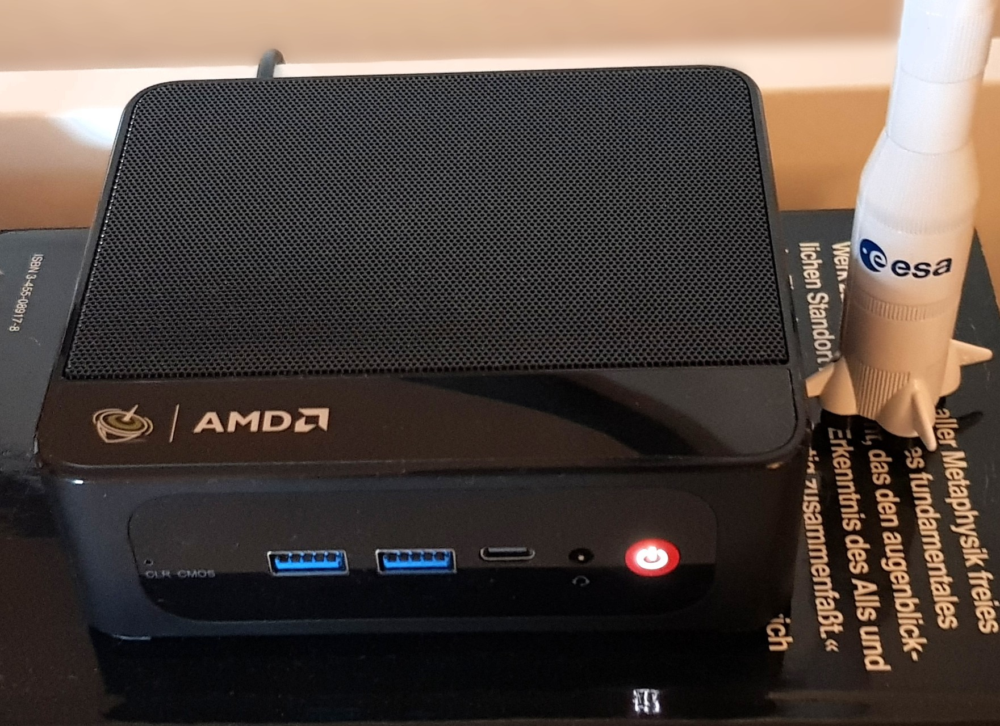

# Production-Grade Kubernetes Homelab [v1]

[](https://kubernetes.io/)
[](https://www.proxmox.com/)
[](https://ubuntu.com/)
[](LICENSE)
[](https://github.com/mmrajput/blog)

> **Multi-node Kubernetes cluster built from scratch for CKA certification preparation and production infrastructure learning**

**Part of my Kubernetes Homelab Series** - This is the foundation project focusing on core Kubernetes concepts, monitoring, and GitOps workflows on bare-metal infrastructure.

## 📚 Homelab Series

This is **Part 1** of my Kubernetes homelab journey:

- **kubernetes-homelab-01** (This Project): Foundation - Proxmox + K8s + Monitoring
- **kubernetes-homelab-02** (Planned): Cloud-native - Terraform + Cloud Provider
- **kubernetes-homelab-03** (Planned): Advanced - Service Mesh + Multi-cluster
- **kubernetes-homelab-04** (Planned): Production - Security + HA + DR

Each homelab builds on learnings from previous ones while exploring new technologies and approaches.

---

## 📋 Table of Contents

- [Overview](#overview)
- [Architecture](#architecture)
- [Tech Stack](#tech-stack)
- [Features](#features)
- [Hardware Setup](#hardware-setup)
- [Quick Start](#quick-start)
- [Project Structure](#project-structure)
- [Learning Outcomes](#learning-outcomes)
- [Blog Series](#blog-series)
- [Roadmap](#roadmap)
- [Contributing](#contributing)
- [License](#license)

---

## 🎯 Overview

This homelab project demonstrates production-grade Kubernetes infrastructure deployment on bare-metal virtualization. Built specifically for:

- **CKA (Certified Kubernetes Administrator) exam preparation**
- **Hands-on learning of enterprise DevOps tools and practices**
- **Understanding Kubernetes internals and troubleshooting**

### Why This Project?

Unlike managed Kubernetes services (EKS, GKE, AKS), this homelab provides:

✅ **Deep understanding** of Kubernetes components and networking  
✅ **Production-like environment** with multi-node setup  
✅ **Hands-on experience** with cluster bootstrapping, upgrades, and maintenance  
✅ **Real troubleshooting** scenarios and problem-solving  
✅ **Cost-effective** learning (~€10/month electricity vs cloud costs)  

---

## 🏗️ Architecture

```
┌─────────────────────────────────────────────────────────────┐
│                    Physical Layer                           │
│  Beelink SER5 Pro (Ryzen 7 5800H, 32GB RAM, 500GB NVMe)     │
└─────────────────────────────────────────────────────────────┘
                            │
                    ┌───────┴───────┐
                    │  Proxmox VE   │
                    │  Hypervisor   │
                    └───────┬───────┘
                            │
        ┌───────────────────┼───────────────────┐
        │                   │                   │
┌───────▼────────┐  ┌───────▼──────┐  ┌─────────▼──────┐
│  k8s-master-1  │  │ k8s-worker-1 │  │ k8s-worker-2   │
│  Ubuntu 24.04  │  │ Ubuntu 24.04 │  │ Ubuntu 24.04   │
│  8GB | 4vCPU   │  │ 10GB | 4vCPU │  │ 10GB | 4vCPU   │
└────────────────┘  └──────────────┘  └────────────────┘
        │                   │                   │
        └───────────────────┼───────────────────┘
                            │
                  ┌─────────▼─────────┐
                  │  Kubernetes CNI   │
                  │  (Calico/Flannel) │
                  └───────────────────┘
```

### Network Topology

```
Internet
    │
    ├─► Router (192.168.178.1)
           │
           ├─► Proxmox Host (192.168.178.33)
           │      └─► vmbr0 Bridge
           │            ├─► k8s-master-1 (192.168.178.101)
           │            ├─► k8s-worker-1 (192.168.178.102)
           │            └─► k8s-worker-2 (192.168.178.103)
           │
           └─► Management Laptop (WiFi)
```

---

## 🛠️ Tech Stack

### Infrastructure Layer

| Component | Technology | Version | Purpose |
|-----------|-----------|---------|---------|
| **Hypervisor** | Proxmox VE | 8.x | Bare-metal virtualization |
| **Operating System** | Ubuntu Server | 24.04 LTS | VM base OS |
| **Automation** | Cloud-Init | Latest | VM provisioning |
| **Networking** | Linux Bridge | Native | VM networking |

### Kubernetes Layer

| Component | Technology | Version | Purpose |
|-----------|-----------|---------|---------|
| **Kubernetes** | kubeadm | 1.31.x | Cluster bootstrapping (CKA requirement) |
| **Container Runtime** | containerd | 1.7.x | Container execution |
| **CNI Plugin** | Calico | 3.27.x | Pod networking & network policies |
| **Ingress Controller** | NGINX Ingress | Latest | HTTP/HTTPS routing |
| **Storage** | Local Path Provisioner | Latest | Persistent volumes |

### Observability & Operations

| Component | Technology | Version | Purpose |
|-----------|-----------|---------|---------|
| **Monitoring** | Prometheus | Latest | Metrics collection |
| **Visualization** | Grafana | Latest | Dashboards & alerting |
| **Metrics** | kube-state-metrics | Latest | Kubernetes object metrics |
| **Node Metrics** | node-exporter | Latest | Node-level metrics |
| **GitOps** | ArgoCD | Latest | Declarative deployments |
| **Backup** | Velero | Latest | Cluster backup/restore |

---

## ✨ Features

### Current Implementation

- ✅ **Multi-node Kubernetes cluster** - Production-like topology (1 control plane, 2+ workers)
- ✅ **Bare-metal deployment** - Full control over infrastructure stack
- ✅ **kubeadm installation** - CKA exam-aligned cluster setup
- ✅ **Pod networking** - Calico CNI with network policy support
- ✅ **Ingress controller** - NGINX for HTTP/HTTPS routing
- ✅ **Persistent storage** - Local path provisioner for stateful workloads
- ✅ **Monitoring stack** - Prometheus + Grafana for observability
- ✅ **GitOps workflows** - ArgoCD for declarative deployments

### Security Features

- ✅ **RBAC configured** - Role-based access control
- ✅ **Network policies** - Pod-to-pod traffic control
- ✅ **Pod security standards** - Security context enforcement
- ✅ **TLS certificates** - Cert-manager for automated cert management
- ✅ **Secret management** - Kubernetes secrets + sealed secrets

### Operations

- ✅ **Cluster upgrades** - kubeadm upgrade procedures
- ✅ **etcd backup/restore** - Disaster recovery capability
- ✅ **Resource quotas** - Namespace-level resource limits
- ✅ **Logging** - Centralized log aggregation
- ✅ **Backup strategy** - Velero for cluster state backup

---

## 💻 Hardware Setup

### Beelink SER5 Pro Specifications


*My homelab server - Beelink SER5 Pro mini PC*

```yaml
CPU:        AMD Ryzen 7 5800H
  Cores:    8 cores, 16 threads
  Speed:    3.2 GHz base, 4.4 GHz boost
  
Memory:     32GB DDR4 RAM
  Speed:    3200 MHz

Storage:    500GB NVMe SSD
  Type:     PCIe Gen3 x4

Network:    
  Ethernet: 1Gbps (Realtek)
  WiFi:     WiFi 6 (802.11ax) - not used for Proxmox

Power:      ~25-35W average consumption
Cost:       ~€6-10/month electricity (Germany)
```

### Resource Allocation

```yaml
Proxmox Host:
  Reserved:     2GB RAM, 4 CPU cores
  Available:    30GB RAM, 12 CPU cores

Virtual Machines:
  k8s-master-1: (Control Plane)
    RAM:        8GB
    vCPU:       2
    Disk:       50GB
    
  k8s-worker-1:
    RAM:        10GB
    vCPU:       4
    Disk:       100GB
    
  k8s-worker-2:
    RAM:        10GB
    vCPU:       4
    Disk:       100GB
```

---

## 🚀 Quick Start

### Prerequisites

- Beelink SER5 Pro (or similar mini PC)
- Proxmox VE 8.x installed
- Ubuntu Server 24.04 LTS ISO
- Basic Linux and networking knowledge

### Installation Steps

#### 1. Clone this repository

```bash
git clone https://github.com/mmrajput/kubernetes-homelab-01.git
cd kubernetes-homelab-01
```

#### 2. Set up Proxmox VMs

```bash
# Create Ubuntu Server VMs using cloud-init
cd proxmox/scripts
./create-vm.sh k8s-cp-01 4096 2 40
./create-vm.sh k8s-worker-01 6144 4 60
./create-vm.sh k8s-worker-02 6144 4 60

# Configure networking and SSH
./configure-networking.sh
```

#### 3. Bootstrap Kubernetes cluster

```bash
# On control plane node
cd kubernetes/cluster-setup
./01-install-prerequisites.sh
./02-bootstrap-cluster.sh

# On worker nodes
./03-join-workers.sh
```

#### 4. Deploy CNI plugin

```bash
# Install Calico
kubectl apply -f kubernetes/cluster-setup/calico/calico.yaml

# Verify nodes are ready
kubectl get nodes
```

#### 5. Deploy monitoring stack

```bash
# Install Prometheus + Grafana
cd kubernetes/monitoring
./deploy-monitoring.sh

# Access Grafana
kubectl port-forward -n monitoring svc/grafana 3000:80
```

### Detailed Instructions

For comprehensive setup guides, see:
- 📖 [Installation Guide](docs/guides/installation-guide.md)
- 📖 [Architecture Documentation](docs/architecture/design-decisions.md)
- 📖 [Troubleshooting Guide](docs/guides/troubleshooting.md)

---

## 📁 Project Structure

```
kubernetes-homelab-01/
├── README.md                          # This file
├── LICENSE                            # MIT License
│
├── proxmox/                           # Proxmox VM management
│   ├── vm-templates/                  # Cloud-init templates
│   │   ├── ubuntu-2404.yaml
│   │   └── README.md
│   └── scripts/                       # VM automation scripts
│       ├── create-vm.sh
│       ├── clone-vm.sh
│       └── configure-networking.sh
│
├── kubernetes/                        # Kubernetes configurations
│   ├── cluster-setup/                 # Cluster bootstrapping
│   │   ├── 01-install-prerequisites.sh
│   │   ├── 02-bootstrap-cluster.sh
│   │   ├── 03-join-workers.sh
│   │   ├── kubeadm-config.yaml
│   │   ├── containerd/
│   │   │   └── config.toml
│   │   └── calico/
│   │       └── calico.yaml
│   │
│   ├── workloads/                     # Example applications
│   │   ├── nginx-demo/
│   │   └── test-apps/
│   │
│   ├── monitoring/                    # Observability stack
│   │   ├── prometheus/
│   │   │   ├── values.yaml
│   │   │   ├── alerting-rules.yaml
│   │   │   └── README.md
│   │   └── grafana/
│   │       ├── dashboards/
│   │       └── datasources.yaml
│   │
│   ├── ingress/                       # Ingress controllers
│   │   ├── nginx-ingress/
│   │   │   └── values.yaml
│   │   └── cert-manager/
│   │       └── cluster-issuer.yaml
│   │
│   ├── gitops/                        # GitOps configuration
│   │   ├── argocd/
│   │   │   ├── install.yaml
│   │   │   └── apps/
│   │   └── README.md
│   │
│   └── security/                      # Security policies
│       ├── network-policies/
│       ├── rbac/
│       └── pod-security-standards/
│
├── docs/                              # Documentation
|   ├── architecture/
│   │   ├── architecture.md
│   │   ├── network-design.md
│   │   └── diagrams/
│   │
│   ├── decisions/
│   │   └── phase-0-architecture.md
│   │
│   └── guides/
│       ├── installation-guide.md
│       ├── upgrade-guide.md
│       └── troubleshooting.md
│
├── scripts/                           # Utility scripts
│   ├── backup-etcd.sh
│   ├── restore-etcd.sh
│   ├── cluster-upgrade.sh
│   └── troubleshooting/
│
└── .github/                           # GitHub workflows (future)
    └── workflows/
        └── ci.yml
```

---

## 🎓 Learning Outcomes

### Skills Demonstrated

This project showcases practical experience with:

#### Infrastructure & Virtualization
- ✅ Bare-metal hypervisor deployment (Proxmox VE)
- ✅ Virtual machine lifecycle management
- ✅ Cloud-init automation for VM provisioning
- ✅ Linux system administration (Ubuntu Server)

#### Kubernetes Operations
- ✅ Multi-node cluster deployment with kubeadm
- ✅ Container runtime configuration (containerd)
- ✅ CNI plugin deployment and networking
- ✅ Ingress controller setup and management
- ✅ Persistent storage configuration
- ✅ Cluster upgrades and maintenance
- ✅ etcd backup and disaster recovery

#### Observability & Monitoring
- ✅ Prometheus metrics collection
- ✅ Grafana dashboard creation
- ✅ Alert configuration and management
- ✅ Log aggregation strategies

#### Security
- ✅ RBAC policy implementation
- ✅ Network policy configuration
- ✅ Pod security standards enforcement
- ✅ TLS certificate management

#### DevOps Practices
- ✅ GitOps workflows with ArgoCD
- ✅ Infrastructure as Code principles
- ✅ Documentation and knowledge sharing
- ✅ Troubleshooting and problem-solving

---

## 📝 Blog Series

Detailed technical blog posts documenting the entire journey:

1. **[Installing Proxmox VE on Beelink SER5 Pro](https://github.com/mmrajput/blog/blob/main/kubernetes/homelab-01/01-proxmox-installation.md)**  
   *Setting up the hypervisor foundation*

2. **[Creating Ubuntu VMs with Cloud-Init](https://github.com/mmrajput/blog/blob/main/kubernetes/homelab-01/02-vm-creation-ubuntu-template.md)** *(Coming Soon)*  
   *Automated VM provisioning and templating*

3. **[Deploying Multi-Node Kubernetes with kubeadm](https://github.com/mmrajput/blog/blob/main/kubernetes/homelab-01/03-kubernetes-cluster-kubeadm.md)** *(Coming Soon)*  
   *Cluster bootstrapping and configuration*

4. **[Understanding Kubernetes Networking with Calico](https://github.com/mmrajput/blog/blob/main/kubernetes/homelab-01/04-kubernetes-networking-calico.md)** *(Coming Soon)*  
   *CNI plugins and network policies*

5. **[Monitoring Kubernetes: Prometheus & Grafana](https://github.com/mmrajput/blog/blob/main/kubernetes/homelab-01/05-monitoring-prometheus-grafana.md)** *(Coming Soon)*  
   *Building observability into your cluster*

6. **[GitOps with ArgoCD](https://github.com/mmrajput/blog/blob/main/kubernetes/homelab-01/06-gitops-argocd.md)** *(Coming Soon)*  
   *Declarative, automated deployments*

7. **[Kubernetes Security Hardening](https://github.com/mmrajput/blog/blob/main/kubernetes/homelab-01/07-kubernetes-security-hardening.md)** *(Coming Soon)*  
   *Production-ready security practices*

8. **[CKA Exam Preparation Guide](https://github.com/mmrajput/blog/blob/main/kubernetes/homelab-01/08-cka-exam-preparation-guide.md)** *(Coming Soon)*  
   *Study strategies and practice scenarios*

📖 **[View All Blog Posts](https://github.com/mmrajput/blog)**

---

## 🗺️ Roadmap

### ✅ Phase 1: Foundation (Completed)
- [x] Proxmox VE installation and configuration
- [x] Ubuntu Server VM template creation
- [x] Network design and implementation

### 🚧 Phase 2: Kubernetes Core (In Progress)
- [x] Multi-node cluster deployment with kubeadm
- [x] Calico CNI installation
- [x] NGINX Ingress controller
- [x] Local path provisioner
- [ ] CoreDNS optimization

### 📋 Phase 3: Observability (Planned)
- [ ] Prometheus metrics collection
- [ ] Grafana dashboards
- [ ] Alert manager configuration
- [ ] Log aggregation (EFK/Loki)

### 📋 Phase 4: GitOps & Automation (Planned)
- [ ] ArgoCD installation
- [ ] Application deployment automation
- [ ] Multi-environment setup (dev/staging/prod)
- [ ] GitHub Actions CI/CD integration

### 📋 Phase 5: Production Hardening (Planned)
- [ ] Network policy implementation
- [ ] Pod security standards
- [ ] Resource quotas and limits
- [ ] Backup automation with Velero
- [ ] Disaster recovery procedures

### 📋 Phase 6: Advanced Features (Future)
- [ ] Multi-cluster management
- [ ] Service mesh (Istio/Linkerd)
- [ ] Advanced monitoring (Thanos)
- [ ] Policy enforcement (OPA/Kyverno)

---

## 🤝 Contributing

This is a personal learning project, but suggestions and feedback are welcome!

### Found an Issue?

- 🐛 [Report a bug](https://github.com/mmrajput/kubernetes-homelab-01/issues)
- 💡 [Suggest an improvement](https://github.com/mmrajput/kubernetes-homelab-01/issues)
- 📖 [Improve documentation](https://github.com/mmrajput/kubernetes-homelab-01/pulls)

### Want to Learn Together?

- ⭐ Star this repo if you find it helpful
- 🔔 Watch for updates as the project evolves
- 💬 Open discussions for questions or ideas

---

## 📄 License

This project is licensed under the MIT License - see the [LICENSE](LICENSE) file for details.

---

## 🙏 Acknowledgments

- **Kubernetes Community** - Excellent documentation and resources
- **Proxmox Team** - Powerful open-source virtualization
- **CKA Exam Curriculum** - Structured learning path
- **DevOps Community** - Inspiration and best practices

---

## 📫 Connect

- **Blog:** [Technical Blog](https://github.com/mmrajput/blog)
- **LinkedIn:** [https://www.linkedin.com/in/mahmood-rajput/](#)
- **Email:** mahmoodrajput.cloud@gmail.com

---

## 📊 Project Stats


**Last Updated:** 25 December 2025 

---

<p align="center">
  <strong>Built with ❤️ for learning and sharing knowledge</strong>
  <br>
  <sub>From Systems Analyst to Platform Engineer</sub>
</p>

---

## 🎯 CKA Exam Coverage

This homelab covers **100% of CKA exam domains:**

| Domain | Coverage | Hands-On Practice |
|--------|----------|-------------------|
| **Cluster Architecture, Installation & Configuration** (25%) | ✅ Complete | kubeadm setup, etcd backup/restore, cluster upgrades |
| **Workloads & Scheduling** (15%) | ✅ Complete | Deployments, DaemonSets, static pods, scheduling |
| **Services & Networking** (20%) | ✅ Complete | Services, Ingress, Network Policies, DNS |
| **Storage** (10%) | ✅ Complete | PV, PVC, StorageClasses, volume management |
| **Troubleshooting** (30%) | ✅ Complete | Multi-node debugging, logs, events, cluster health |

**Total Coverage:** 100% ✅

---

**Happy Learning! 🚀**
